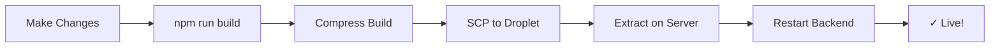

# 🚀 ASTRO-ASIX Frontend Deployment Scripts

## Quick Start (3 Steps)

### 1️⃣ Setup SSH Key (One-time)
```powershell
.\setup-ssh-key.ps1
```
This sets up passwordless SSH authentication to your droplet.

### 2️⃣ Deploy Frontend
```powershell
.\deploy-frontend-to-droplet.ps1 -RestartContainers
```
This builds, transfers, and deploys your React frontend.

### 3️⃣ Verify
Open http://209.38.226.32 in your browser! 🎉

---

## Scripts Overview

| Script | Purpose | When to Use |
|--------|---------|-------------|
| `setup-ssh-key.ps1` | Configure SSH keys | Once, before first deployment |
| `deploy-frontend-to-droplet.ps1` | Deploy frontend | Every time you update frontend |
| `deploy-frontend.ps1` | Local build script | For local testing only |

---

## Common Commands

### First Time Setup
```powershell
# 1. Setup SSH (one-time)
.\setup-ssh-key.ps1

# 2. Deploy
.\deploy-frontend-to-droplet.ps1 -RestartContainers

# 3. Test
Invoke-WebRequest http://209.38.226.32/api/health
```

### Regular Deployments
```powershell
# Full rebuild and deploy
.\deploy-frontend-to-droplet.ps1 -RestartContainers

# Quick deploy (no rebuild)
.\deploy-frontend-to-droplet.ps1 -SkipBuild -RestartContainers
```

### Troubleshooting
```powershell
# Test SSH connection
ssh root@209.38.226.32 "echo Connected"

# Check droplet status
ssh root@209.38.226.32 "cd /root/astroaxis_control && docker compose ps"

# View logs
ssh root@209.38.226.32 "cd /root/astroaxis_control && docker compose logs --tail=100 backend"

# Check disk space
ssh root@209.38.226.32 "df -h"
```

---

## Architecture

```
┌─────────────────────────────────────────────────┐
│  Windows PC (Development)                       │
│  ├─ C:\Users\USER\ASTROAXIS\frontend\build     │
│  └─ Scripts: deploy-frontend-to-droplet.ps1    │
└────────────────┬────────────────────────────────┘
                 │ SSH/SCP Transfer
                 ▼
┌─────────────────────────────────────────────────┐
│  DigitalOcean Droplet (209.38.226.32)          │
│  └─ /root/astroaxis_control/                   │
│     ├─ frontend/build/ (React static files)    │
│     └─ docker-compose.yml                      │
│                                                 │
│  Docker Containers:                             │
│  ├─ backend (FastAPI) → Port 80                │
│  │  ├─ Serves API: /api/*                      │
│  │  └─ Serves Frontend: /*                     │
│  └─ db (PostgreSQL) → Port 5432                │
└─────────────────────────────────────────────────┘
```

---

## Deployment Flow



---

## File Locations

### On Windows (Local)
```
C:\Users\USER\ASTROAXIS\
├─ frontend\
│  ├─ src\                          # React source code
│  ├─ build\                        # Built files (generated)
│  └─ package.json
├─ backend\
│  └─ app\main.py                   # Serves frontend
├─ docker-compose.yml               # Simplified (no nginx)
├─ setup-ssh-key.ps1                # SSH setup script
├─ deploy-frontend-to-droplet.ps1   # Main deployment script
└─ FRONTEND_DEPLOYMENT_GUIDE.md     # Full documentation
```

### On Droplet (Production)
```
/root/astroaxis_control/
├─ frontend\
│  └─ build\                        # Deployed React files
│     ├─ index.html
│     ├─ static\
│     │  ├─ js\
│     │  └─ css\
│     ├─ manifest.json
│     └─ serviceWorker.js
├─ backend\
│  └─ app\main.py                   # FastAPI (serves frontend)
├─ docker-compose.yml
└─ .env                             # Environment variables
```

---

## Environment Variables

Required in `/root/astroaxis_control/.env` on droplet:

```env
DB_PASSWORD=your_secure_password_here
SECRET_KEY=your_jwt_secret_key_here
DEBUG=False
ENVIRONMENT=production
```

---

## Ports

| Port | Service | Access |
|------|---------|--------|
| 80 | FastAPI Backend + Frontend | Public (http://209.38.226.32) |
| 8004 | FastAPI Backend | Internal (container) |
| 5432 | PostgreSQL | Internal (container) |
| 22 | SSH | For deployment only |

---

## URLs After Deployment

| URL | Description |
|-----|-------------|
| http://209.38.226.32 | Main React App |
| http://209.38.226.32/api/health | API Health Check |
| http://209.38.226.32/api/docs | API Documentation (Swagger) |
| http://209.38.226.32/manifest.json | PWA Manifest |
| http://209.38.226.32/serviceWorker.js | Service Worker |

---

## Maintenance Commands

### Update Code from Git
```bash
ssh root@209.38.226.32 "cd /root/astroaxis_control && git pull origin main"
```

### Restart All Containers
```bash
ssh root@209.38.226.32 "cd /root/astroaxis_control && docker compose restart"
```

### View Container Status
```bash
ssh root@209.38.226.32 "cd /root/astroaxis_control && docker compose ps"
```

### View Backend Logs
```bash
ssh root@209.38.226.32 "cd /root/astroaxis_control && docker compose logs -f backend"
```

### Run Database Migrations
```bash
ssh root@209.38.226.32 "cd /root/astroaxis_control && docker compose exec backend alembic upgrade head"
```

### Backup Database
```bash
ssh root@209.38.226.32 "cd /root/astroaxis_control && docker compose exec db pg_dump -U postgres axis_db > backup_$(date +%Y%m%d).sql"
```

---

## Security Checklist

- ✅ SSH key authentication (no passwords)
- ✅ Firewall configured (ports 22, 80, 443)
- ✅ Environment variables in .env (not committed)
- ✅ PostgreSQL not exposed publicly
- ⚠️ TODO: Add SSL/TLS certificate (Let's Encrypt)
- ⚠️ TODO: Set up automatic backups
- ⚠️ TODO: Configure monitoring/alerts

---

## Performance

### Current Droplet Specs
- **Plan**: Basic ($6/month)
- **RAM**: 1GB (sufficient for backend + DB)
- **Storage**: 25GB SSD
- **Transfer**: 1TB bandwidth
- **Location**: Frankfurt (fra1)

### Optimization Tips
1. Frontend is pre-built (no npm install on server)
2. Static files served efficiently by FastAPI
3. Docker volumes for persistent data
4. Read-only mounts for security

---

## Troubleshooting Guide

### Problem: "SSH connection failed"
**Solution:**
```powershell
.\setup-ssh-key.ps1
```

### Problem: "Build failed"
**Solution:**
```powershell
cd frontend
npm install
npm run build
```

### Problem: "Transfer failed"
**Solution:**
```powershell
# Test connection
ping 209.38.226.32
Test-NetConnection -ComputerName 209.38.226.32 -Port 22
```

### Problem: "404 Not Found after deployment"
**Solution:**
```bash
ssh root@209.38.226.32
cd /root/astroaxis_control
docker compose logs backend
docker compose restart backend
```

### Problem: "API working but frontend shows errors"
**Solution:**
Check browser console for errors. Frontend might be making requests to wrong API endpoint.

---

## Next Steps

After successful deployment:

1. ✅ **Test all features** - Register, login, test modules
2. ✅ **Set up monitoring** - UptimeRobot, StatusCake
3. ✅ **Configure domain** - Point DNS to 209.38.226.32
4. ✅ **Add SSL certificate** - Let's Encrypt (free)
5. ✅ **Set up backups** - Database and files
6. ✅ **CI/CD pipeline** - GitHub Actions for auto-deploy

---

## Support

For issues:
1. Check logs: `docker compose logs backend`
2. Test health: `curl http://localhost/api/health`
3. Verify files: `ls -lh frontend/build/`
4. Review deployment guide: `FRONTEND_DEPLOYMENT_GUIDE.md`

---

**Ready to deploy?** Run:
```powershell
.\setup-ssh-key.ps1
.\deploy-frontend-to-droplet.ps1 -RestartContainers
```

🚀 **Happy deploying!**
